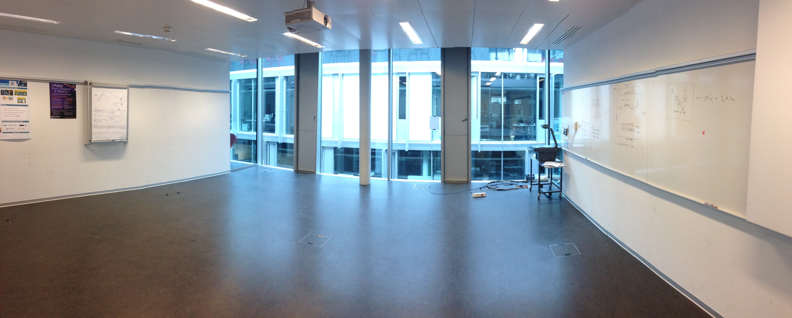
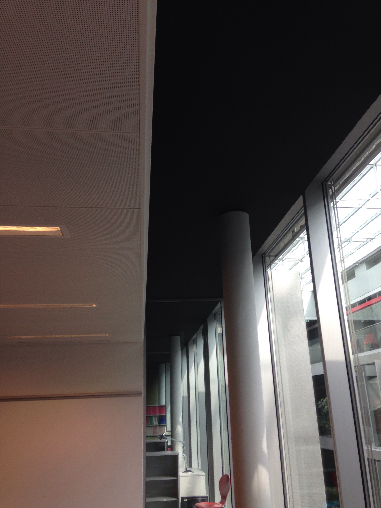
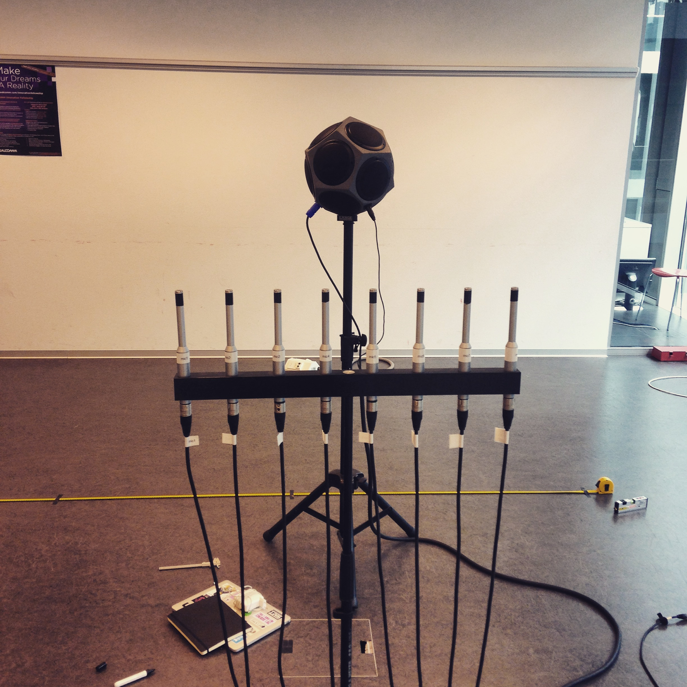
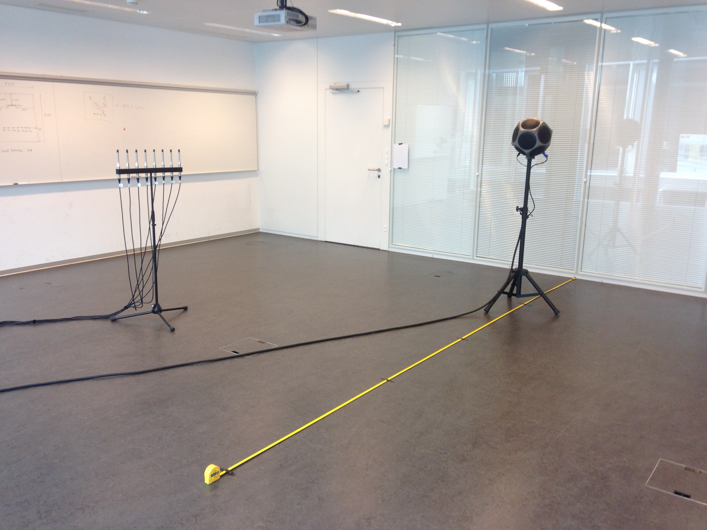
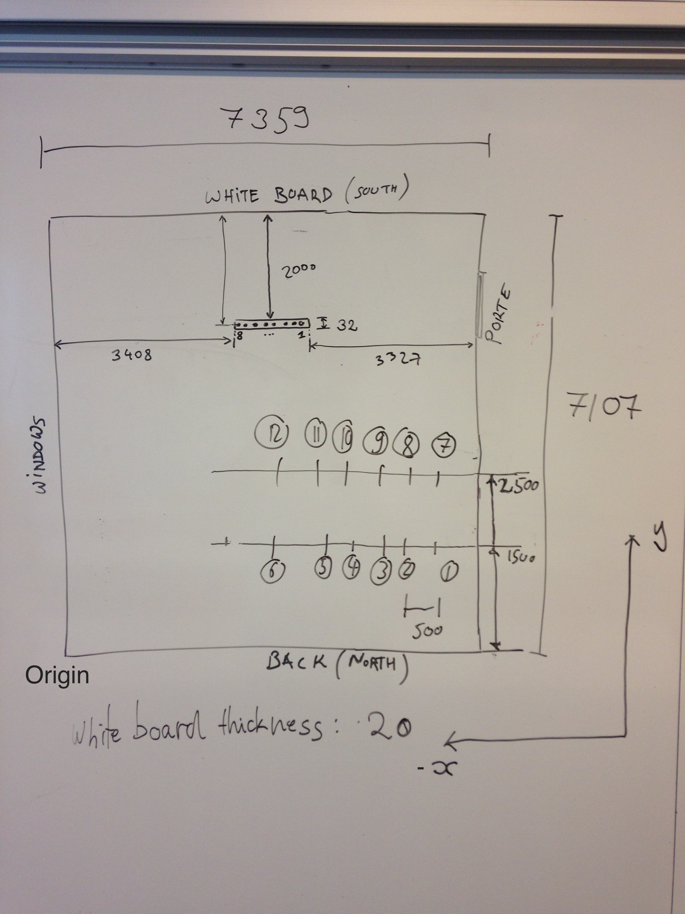
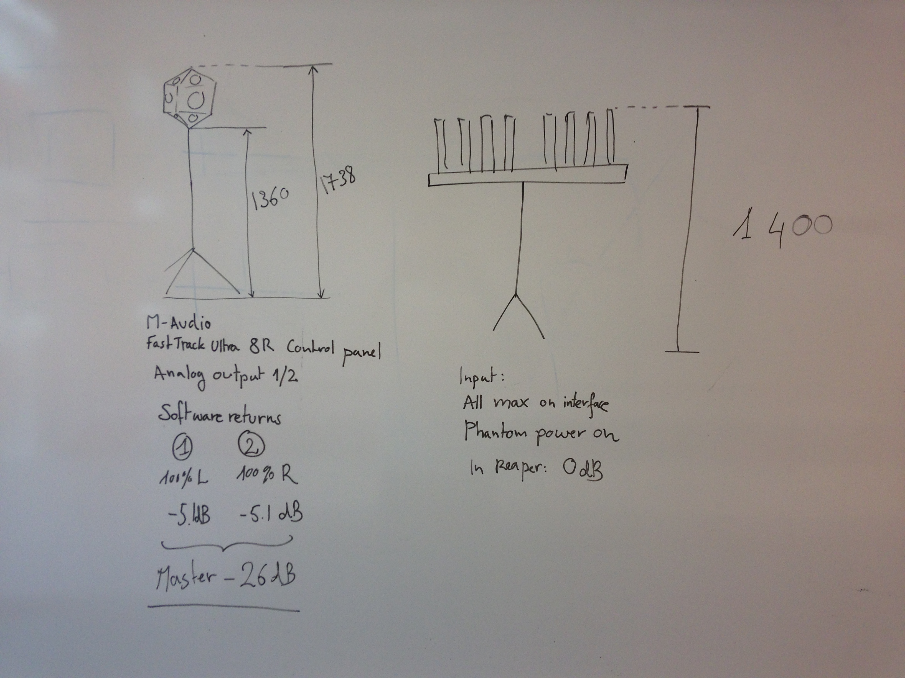

Measurement of BC329
====================

* **Experimenters**: Robin Scheibler, Miranda Kreković
* **Date**: 2015 April 05
* **Location**: BC329, BC Building, EPFL, Lausanne

Description
-----------

This is a dataset of room impulse responses (RIR) measurements of the room BC329 of BC Building at
EPFL, Lausanne, Switzerland. This dataset is processed and downsampled at 8 kHz.

The room was emptied of all furniture. It has a generally shoebox like shape with the following exceptions.

* There is a column on one of the sides of the room.
* There is a suspended ceiling that does not go all the way to the window,
  making the room slightly non-convex.

Environmental parameters
------------------------

As measured 3 days after the experiment, without any significant change in weather conditions
in the interval.

* Temperature: 23.5 Celsius
* Pressure: 980 mbar
* Relative humidity: 33.5 %

Using an [online calculator](http://hyperphysics.phy-astr.gsu.edu/hbase/sound/souspe3.html#c1) the speed
of sound was determined to be `c=345.3559` m/s, which matches the measurements quite nicely.

Material
--------

* 8 microphones Behringer ECM8000
* Interface M-Audio Fast Track Ultra 8R
* Speaker [Lange D12A](http://langeloudspeakers.com/en/product-range/181160/dodecahedron-loudspeaker-d12a)

Software
--------

* [Reaper](http://www.reaper.fm) v4.77/64 rev 61ed3c

Dataset
-------

### RIR.positions

This file contains the room dimension and the locations of the microphones and speakers.

* the dimension of the shoebox approximation to the room.

        room 7.359 7.107 2.698

* the locations of the microphones and speakers with the following syntax

        <m/s> <id> <x> <y> <z>

    where `m` is for a microphone and `s` is for a speaker. For example:

        m 6 3.600 5.091 1.397
        m 7 3.520 5.091 1.397
        m 8 3.440 5.091 1.397
        s 1 5.859 1.509 1.549
        s 2 5.359 1.509 1.549
        s 3 4.859 1.509 1.549

### RIR.files

This file links a pair microphone/speaker to an RIR file. The syntax is the following.

    <mic_id> <spk_id> <Fs> <filename>

All RIRs are stored as in wav file at 8 kHz in 32 bits float LE format.

Methodology
-----------

* The excitation signal is an exponential sine sweep generated by the following code.
    
        import numpy as np
        from scipy.io import wavfile

        f1 = 50.     # Start frequency in [Hz]
        f2 = 22000.  # End frequency in [Hz]
        T  = 11.      # Pulse duration in [s]
        fs = 44100.  # Sampling frequency in [Hz]
        Ts = 1./fs   # Sampling period in [s]
        N = np.floor(T/Ts)
        n  = np.arange(0, N)  # Sample index

        om1 = 2*np.pi*f1
        om2 = 2*np.pi*f2

        x_exp = np.sin(om1*N*Ts / np.log(om2/om1) * (np.exp(n/N*np.log(om2/om1)) - 1))

        wavfile.write('exp_sweep.wav', fs, x_exp)

* We use a linear microphone array with 8 microphones placed uniformly every 8 cm.
  The array is placed parallel to one of the walls.

* The speaker is placed successively at 12 positions in the room as shown in the drawing below.

* The dimensions of the room, as well as the position of microphones and
  speakers relative to the room were measured as precisely as possible.

* The software Reaper was used to start simultaneous recordings of the
  excitation signal and recordings by all 8 microphones. No correction for the
  processing delay of the interface was used.

* At every speaker position, six recordings were done. The speaker was rotated
  by 60 degrees for each recording.

* All recordings were done at 44.1 kHz and 24 bits.

Post-processing
---------------

The post-processing used to transform the recordings into impulse responses is
described in this section.

### Deconvolution

1. All recordings corresponding to one microphone and one speaker position (6
   of them, one for each speaker rotation) are averaged.

2. Take the FFT of the averaged signal, padded with zeros by the same length as
   the recorded signal.

3. Take the FFT of the excitation signal, padded with zeros to match the length of the previous FFT.

4. Divide the signal obtained at 2. by that of 3.

5. Take the inverse FFT of the signal obtained at 4.

### Estimation of interface delay

We would like to estimate the delay D of the interface. We have the following parameters.

* D: delay of interface (unknown)
* r: radius of speaker (known)
* c: speed of sound (known from temperature and humidity)
* t(i): time of arrival of direct sound in measured RIR for ith measurement (known for all 8x12=96 measurements)
* d(i): distance between center of speaker and microphone for ith measurement (known for all 8x12=96 measurements)

We estimate the delay as `D = median[(d(i) - r)/c - t(i)]`, where the median is
taken over all measurements indexed by `i`. We find `D = ~4ms`.

The RIR are finally fixed by offsetting the RIR by `r/c - D` samples so that
the arrival of the direct sound matches the time-of-flight.

### Downsampling

The 44.1 kHz RIR were downsampled to 8 kHz using the
[scikits.samplerate](https://pypi.python.org/pypi/scikits.samplerate) package.

